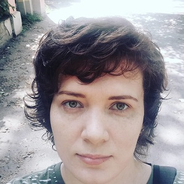

# Olga Veter

## Contacts

* __Location__: Taganrog, RF
* __Email__: olkaveter@yandex.ru
* __Telegram__: [veter04eg](https://t.me/veter04eg)
* __Discord__: Olga Veter (@vetero4eg)
* __GitHub__: [vetero4eg](https://github.com/vetero4eg)

## About Me

I have been engaged in web development since 2016. Since November 2018, I have been a mentor at the HTML Academy and at few other courses. I am interested in training courses, including RS-SCHOOL, in order to strengthen my knowledge and improve my skills, including teaching skills.

## Skils

* HTML / CSS  
* JS
* Vue.js
* Vuex, Pinia
* Nuxt
* XSLT

> I write unit and e2e tests using Jest, Vue Test Util and Cypress, Nightwatch.
> I use css and js animations, GSAP, freely implement responsive layout.
> I work with Pug, LESS/SASS/Stylus, Tailwind, Gulp, Webpack, Docker.
> I read documentation and technical literature in English.

## Code example
 
[Codewars task "Josephus Survivor"](https://www.codewars.com/kata/555624b601231dc7a400017a)
```
function josephusSurvivor(n,k){
  let elIndex = 0;
  let step = 1;
  
  while(step <= n) {
    elIndex = (elIndex + k) % step;
    step++;
  }
  
  return elIndex + 1;
 
}
```
## Some projects
 
[CSSBayan](https://vetero4eg.github.io/cssBayan/cssBayan/index.html)
[NSK](http://vetero4eg.github.io/Demo/NSK/index.html)
[YouTube Video List](https://test-ytvideolist.firebaseapp.com/?id=Xj3gU3jACe8,E4w_5bY0tBY,bdkVzkIGjp0,yWXCzlTMfd0,uT3SBzmDxGk,N-YuSKeFMxY,D9LrEXF3USs,x8yymm3DtVA,0qChBDD8DLE,x8yymm3DtVA,P3LjmYl4Yd8,3V7EugoweM4,qfGggAGITwg,8lWXXHiQf6M,kL6fN3HNAXo,CX11yw6YL1w,nji5zvkuuFg,jvipPYFebWc,1KFSfoBIgcg,oUBQPIk9Wh8,UimyAzjEyWU,)
[Continental](http://vetero4eg.github.io/Demo/Continental/index.html)
[Prorock logo animation](https://codepen.io/vetero4eg/pen/yvPGZx)
